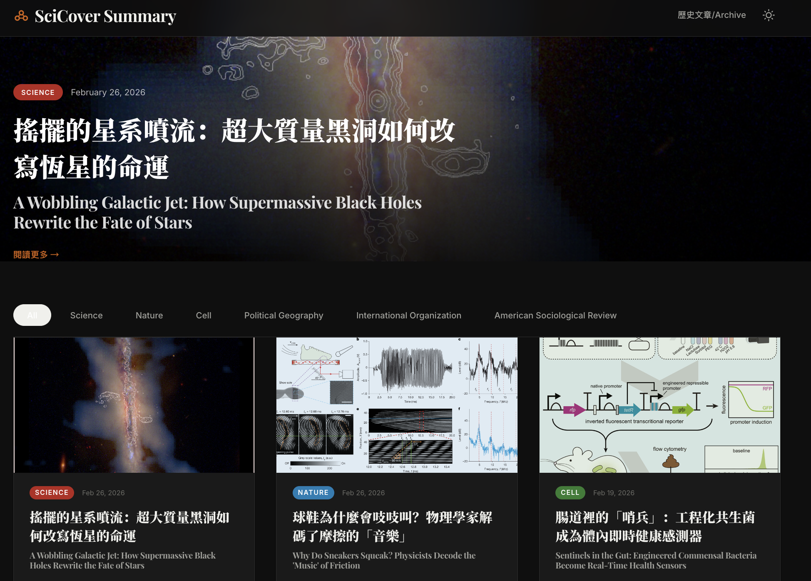

# SciCover

**全球頂級科學期刊封面故事 · 雙語解讀**
*Top Science Journal Cover Stories · Bilingual Summaries*

---

## 為什麼需要 SciCover？

每週，Science、Nature、Cell 等頂級期刊都會發表突破性的封面研究，但普通讀者很難觸及這些內容：

- **語言門檻**：論文全是英文，專業術語密集，非母語讀者難以消化
- **資訊分散**：要追蹤多本期刊，需要在不同網站之間反覆切換
- **內容艱澀**：即使看得懂英文，學術寫作的風格也讓一般人望而卻步
- **時間成本**：每週手動查看各期刊官網、找出封面故事，耗時費力
- **缺乏中文科普**：市面上幾乎沒有即時、高品質的中文科學封面故事解讀

**SciCover 解決這些問題。** 它自動抓取頂級期刊的封面故事，用 AI 生成中英雙語的通俗解讀，讓任何人都能在一個網站上輕鬆了解最前沿的科學進展。

---

## 功能特色

### 🔬 自動追蹤三大期刊
呈現 **Science**、**Nature**、**Cell** 等期刊的最新封面故事，無需手動檢查。

### 🌐 中英雙語摘要
AI 生成的摘要不是逐字翻譯，而是面向大眾的「意譯式改寫」——中文讀者能讀懂，英文讀者也有原味解讀。

### 📱 現代化閱讀體驗
仿照 Quanta Magazine 的雜誌風格設計，支援：
- **期刊篩選**：一鍵切換 Science / Nature / Cell 或查看全部
- **深色模式**：白天黑夜都舒適閱讀
- **響應式佈局**：手機、平板、桌面都完美呈現
- **圖片展示**：封面圖與文內配圖，附帶雙語圖說

### 📅 歷史歸檔
按年月瀏覽過往的封面故事，建立你的科學閱讀時間軸。

### 💰 零成本運行
全站部署在 GitHub Pages，使用 GitHub Models API 的免費額度產生摘要，不需要任何伺服器或付費服務。

---

## 線上預覽

部署後的網址格式：
[SciCover_Summary](https://lch99310.github.io/SciCover_Summary/)

---

## 新增期刊

1. 在 `scripts/scraper/` 建立新的爬蟲模組（例如 `lancet_scraper.py`）
2. 繼承 `BaseScraper`，實作 `scrape()` 方法
3. 在 `pipeline/runner.py` 的 `SCRAPER_MAP` 中註冊
4. 在 `frontend/src/lib/constants.ts` 的 `JOURNALS` 陣列中新增
5. 本地測試：`python -m main --journal Lancet`
6. 合併 PR 後，每週排程會自動開始處理

---
